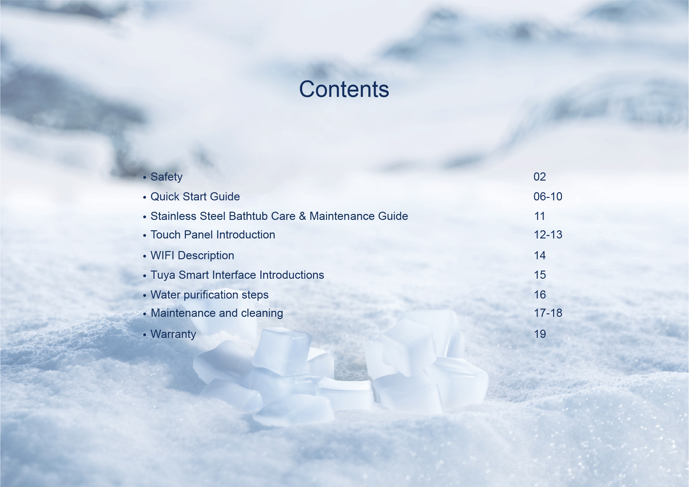

 All In One YG-G5
https://1604163742706683.appflow.aliyunnest.com/webhook/home/b271bff12f8e717f5d98cc5a9edd6de374f361b10185ab11439ec13f417092e4929209c4421f8c68f6/index
<iframe src=https://1604163742706683.appflow.aliyunnest.com/webhook/home/b271bff12f8e717f5d98cc5a9edd6de374f361b10185ab11439ec13f417092e4929209c4421f8c68f6/index width='100%' height='100%' frameborder='0'></iframe>

If you want to watch detailed product operation videos, you can click the link below:

